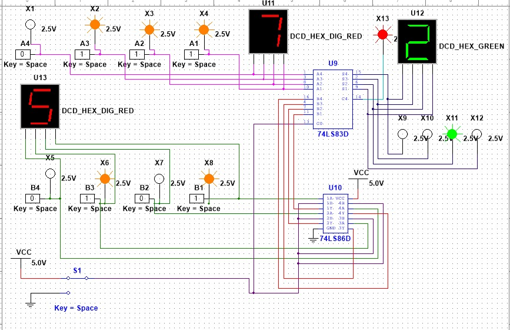

# 4-Bit Binary Adder-Subtractor

This project is a digital circuit simulation of a 4-bit Adder-Subtractor. It uses a **74LS83** 4-bit adder and **74LS86** XOR gates to perform binary arithmetic.

## Features
* **Addition Mode:** Adds two 4-bit numbers (A + B).
* **Subtraction Mode:** Subtracts Input B from Input A (A - B) using 2's complement logic.
* **Hex Displays:** Real-time visual output for inputs and results.

## Circuit Operation
Below are the screenshots of the circuit in action:

### Addition Mode

### Subtraction Mode

---
## Components
* **74LS83:** 4-Bit Binary Full Adder
* **74LS86:** Quad 2-Input XOR Gates
* **DCD_HEX:** Hexadecimal Indicators
